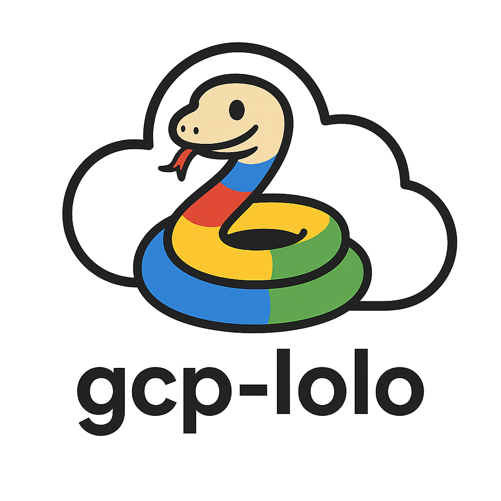

# gcp-lolo

<p align="center">
  
</p>

**GCP** Cloud **Lo**gging Python **lo**gger

The idea behind this package is to provide the simplest way to log messages to Google Cloud Logging, without having to worry about the details of setting up the Google Cloud Logging client and/or affecting the current application structure.

## Installation

```bash
pip install gcp-lolo
```

## Usage

### #1: Using a python logger

The recommended and idiomatic way to use this package is to create a logging configuration and initialize a logger in your application and in any other sub module(s) as per [Python's Logging HOWTO](https://docs.python.org/3/howto/logging.html).

#### Defining the logging configuration via a INI file

1. Create a file `logging.ini` in your project root folder with the following content:

```ini
[loggers]
keys=root

[handlers]
keys=gcp_handler

[formatters]
keys=

[logger_root]
level=INFO
handlers=gcp_handler

[handler_gcp_handler]
class=gcp_lolo.GCPLoggingHandler
level=DEBUG
kwargs={"name": "my-test-app", "gcp_credentials_path": "./gcp_credentials.json"}
```

2. In your application code, initialize the logger as follows:

```python
import logging
from logging.config import fileConfig

fileConfig('logging.ini')
logger = logging.getLogger(__name__)

# use the logger as usual
logger.debug('Unuseful message in production')
logger.info('This is an info message')
logger.warning('This is a warning')
logger.error('This is an error')
```

#### Defining the logging configuration via the dictConfig method

With the [dictConfig](https://docs.python.org/3/library/logging.config.html#logging.config.dictConfig) method you are able to arrange the configuration as you wish.

In the following example, the configuration is written in YAML.

1. Write the configuration in a `logging.yaml` file:

```yaml
version: 1
disable_existing_loggers: false
handlers:
  gcp_handler:
    class: gcp_lolo.GCPLoggingHandler
    level: INFO
    name: my-test-app
    gcp_credentials_path: "./gcp_credentials.json"
    # gcp_credentials_json: "{somecredentialshere}" # alternative to gcp_credentials_path
loggers:
  root:
    level: INFO
    handlers: [gcp_handler]
```

2. In your application code, initialize the logger as follows:

```python
import logging
import logging.config
import yaml

with open('logging.yaml', 'r') as f:
    config = yaml.safe_load(f.read())
    logging.config.dictConfig(config)

logger = logging.getLogger(__name__)

# use the logger as usual
logger.debug('Unuseful message in production')
logger.info('This is an info message')
logger.warning('This is a warning')
logger.error('This is an error')
```

Of course, please remember to install `PyYAML` to be able to read the YAML configuration file.

### #2: Redirect stdout to GCP Logging

This method is recommended when you have a lot of code that uses `print` and `raise` statements, and you don't want to change it.

```python
from gcp_lolo import setup_gcp_logging


setup_gcp_logging('my-logger')

print('This is a test message')

raise Exception('This is a test exception')
```

⚠ **Important**: This method will NOT work in case of any submodules that initialize their own logger. In that case, you should use the first method instead.

## Authentication

As the package exports logs on GCP Logging, you need some GCP credentials. You can provide them in the following ways:

1. By setting either one of the following environment variables:
   - `GOOGLE_APPLICATION_CREDENTIALS`: the path to the local GCP credentials file, or
   - `GCP_CREDENTIALS_JSON`: a string containing the GCP credentials JSON
2. By passing the one of the following parameters to the `GCPLoggingHandler` class:
   - `gcp_credentials_path`: the path to the local GCP credentials file, or
   - `gcp_credentials_json`: a string containing the GCP credentials JSON

## Examples

For more examples, see the [examples](./examples) folder.

## Additional Information

### Multiple Handlers

**Please note**: by default, gcp-lolo will NOT print anything to the console. If you want to print logs to the stdout as well, you can add another handler to the logger.

The following is an example of a `logging.ini` file that uses two different handlers:

```ini
[loggers]
keys=root

[handlers]
keys=gcp_handler,console_handler

[formatters]
keys=stdOutMessageFormatter

[logger_root]
level=INFO
handlers=gcp_handler,console_handler

[handler_gcp_handler]
class=gcp_lolo.GCPLoggingHandler
level=INFO
kwargs={"name": "my-app-with-multiple-logging-handlers", "gcp_credentials_path": "./gcp_credentials.json"}

[handler_console_handler]
class=logging.StreamHandler
level=DEBUG
formatter=stdOutMessageFormatter

[formatter_stdOutMessageFormatter]
format=%(asctime)s - %(levelname)s - %(name)s - %(message)s
```

Of course, this applies to any other logging configuration method you may be using.

### Labeling messages

You can add labels to your messages by passing a `labels` dictionary to the `kwargs` of the `GCPLoggingHandler` in the `logging.ini` file.

Example (pay attention to the `handler_gcp_handler` kwargs):

```ini
[loggers]
keys=root

[handlers]
keys=gcp_handler

[formatters]
keys=

[logger_root]
level=INFO
handlers=gcp_handler

[handler_gcp_handler]
class=gcp_lolo.GCPLoggingHandler
level=DEBUG
kwargs={"name": "my-test-app", "gcp_credentials_path": "./gcp_credentials.json", "labels": {"environment": "staging", "app_version": "1.0.0"}}
```

## Reference

- [Google Cloud Logging](https://cloud.google.com/logging)
- [Google Cloud Logging Python Client](https://cloud.google.com/logging/docs/reference/libraries#client-libraries-install-python)

## License

This project is licensed under the MIT License - see the [LICENSE](./LICENSE) file for details.

## Contributing

Contributions are welcome! Please open an issue or submit a pull request.
